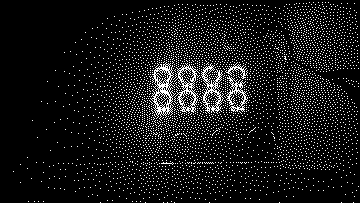

# ma-trix

Matrix mixer for crow+norns

    m ⊘ ⊘ ⊘ ⊘
    a ⊘ ⊘ ⊘ ⊘
      t r i x

Use <kbd>e1</kbd> to choose an output, and adjust the values with <kbd>e2</kbd> and <kbd>e3</kbd>. Simple. It's an atternuverter actually." The levels are also norns parameters, which you might want to map to MIDI or an OSC control surface.

Not really great for audio. Unless you like a whole lot of bitcrushing. Use it for CVy things, although as we know these are the same thing actually: dancing voltage.

## Ideas

- [ ] amplify?
- [ ] other routings?
- [x] weirder name/concept?
- [ ] artier graphics?
- [ ] what should norns keys do on a mixer? momentary mute? toggel bipolar/unipolar, randomize?
- [ ] lfos? well there is already matrix mod
